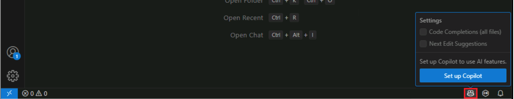

---
lab:
  title: Préparer - Activer GitHub Copilot dans Visual Studio Code
  description: Effectuez les étapes requises pour activer GitHub Copilot dans Visual Studio Code.
---

# Activez GitHub Copilot dans Visual Studio Code

GitHub propose trois plans GitHub Copilot pour les développeurs individuels et deux plans pour les organisations et les entreprises. Les plans sont conçus pour répondre aux besoins des développeurs individuels, des équipes et des organisations. Le plan GitHub Copilot Free est disponible pour les utilisateurs individuels de GitHub, tandis que les plans payants sont disponibles pour les particuliers et les organisations qui ont besoin de fonctionnalités et de capacités supplémentaires.

Effectuez les étapes suivantes pour activer GitHub Copilot dans Visual Studio Code :

1. Ouvrez Visual Studio Code.

1. Assurez-vous que la dernière version de Visual Studio Code est installée.

    Pour vérifier les mises à jour, sélectionnez **Gérer** (icône en forme d’engrenage) dans le coin inférieur gauche de la fenêtre Visual Studio Code, puis sélectionnez **Rechercher les mises à jour**.

1. Dans la barre d’état de Visual Studio Code, pour activer GitHub Copilot, placez le curseur de la souris sur l’icône Copilot, puis sélectionnez **Configurer Copilot**.

    

1. Sur la page **Se connecter pour utiliser Copilot gratuitement**, sélectionnez **Se connecter**.

    La page de connexion au compte GitHub s’ouvre dans votre navigateur web par défaut.

1. Sur la page de connexion GitHub, entrez les identifiants du compte GitHub que vous utiliserez pour cet exercice, puis sélectionnez **Se connecter**.

1. Suivez les instructions en ligne pour authentifier votre compte et autoriser l’accès dans Visual Studio Code.

    Vous serez redirigé vers Visual Studio Code une fois le processus d’authentification/d’autorisation terminé.

1. Pour vérifier que GitHub Copilot est activé, ouvrez la vue **Extensions** de Visual Studio Code.

    Vous devriez voir les extensions GitHub Copilot et GitHub Copilot Chat répertoriées dans la section **Installées** de la vue Extensions.

    
